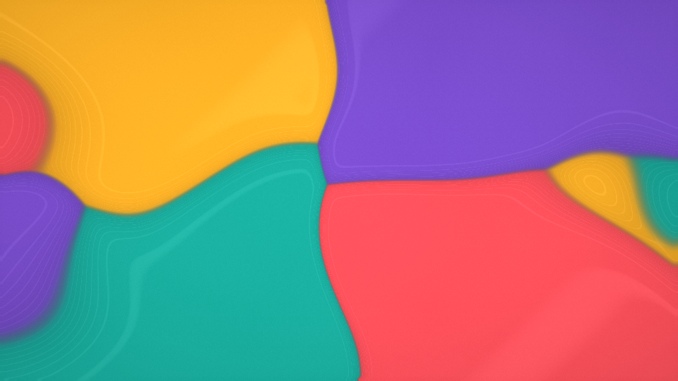

# FlowGarden



FlowGarden is an offline, shader-driven visual playground inspired by fluid motion and *karesansui*, the Japanese tradition of dry landscape gardens. It can unfold on its own as a continuously evolving composition or become a hands-on zen-garden canvas, where colorful fields are combed around stones with the mouse.

> [!IMPORTANT]
> FlowGarden is an artistic simulation, not a physics simulation. Its numerical passes are inspired by real-time incompressible-flow techniques, but they are deliberately tuned for visual behavior. The output must not be interpreted as a physically accurate model of fluids, viscosity, pigments, pressure, material mixing, or solid-fluid interaction.

The application has no accounts, telemetry, analytics, cloud services, advertisements, or automatic update checks. Once downloaded and extracted, it runs entirely on the local computer. See [Privacy](PRIVACY.md) for the complete offline guarantee.

## Download for Windows

[](https://github.com/salamon/FlowGarden/releases/latest/download/FlowGarden-windows-x64.zip)

Download the ZIP, extract the complete `FlowGarden` folder, and run `FlowGarden.exe`. Keep the `_internal` folder next to `FlowGarden.exe`; do not move the executable by itself. No Python installation is required. The executable is currently unsigned, so Windows SmartScreen may display a warning.

Windows is the only verified platform and the only standalone package provided. The source uses a cross-platform stack and an OpenGL 4.1 renderer, but Linux and macOS have not yet been tested and are not claimed as supported.

## Highlights

- Real-time GPU rendering with Python, ModernGL, GLFW, and GLSL.
- Autonomous flow and a hands-on zen-garden mode on the same canvas.
- Four stylized, immiscible-looking pigment fields with five color palettes.
- Randomized, karesansui-inspired rocks that redirect the artistic flow.
- Multi-monitor fullscreen that stays active when another monitor receives focus.
- A deliberately small codebase designed to be read, modified, and forked.
- Fully offline execution with no data collection.

## Two ways to experience FlowGarden

In **Autonomous Flow**, the composition evolves continuously and can be left running as ambient generative art. The mouse can still disturb, comb, and swirl the pigment fields at any time.

In **Zen Garden**, autonomous forcing is paused. The moving color fields take the place of raked material: add and arrange stones, then use deliberate mouse gestures to shape the composition. Press `Space` to move freely between the two experiences without resetting the canvas.

Karesansui is FlowGarden's starting metaphor, not a claim of literal or historical reproduction. The project borrows a small visual vocabulary—stones, open space, raking gestures, and quiet composition—and reinterprets it as an abstract digital artwork.

## Project intent

FlowGarden is meant to work at two levels: as an approachable contemplative application and as a compact graphics project that can be studied and changed. The shader pipeline is kept explicit, while the Python host code stays small and focused on windowing, input, GPU resources, and render-pass orchestration.

Using the application and forking the code are equally valid outcomes. Release packages should make FlowGarden easy to run without a development environment; concise documentation and readable GLSL should make it easy to learn from, modify, or take in a different artistic direction.

## Requirements

- Python 3.12 is recommended for running from source.
- A GPU and driver supporting OpenGL 4.1 or newer.
- Windows is currently tested. Linux and macOS remain unverified.

OpenGL 4.1 keeps the renderer within the native OpenGL version available on macOS. This makes a source port technically plausible, but it is not evidence that the application currently builds or runs correctly there. Reports and focused portability contributions from Linux and macOS users are welcome.

## Run from source

Clone the repository, create a virtual environment, and install the project. The example below uses Windows PowerShell; other shells use their usual virtual-environment activation command.

```powershell
git clone https://github.com/salamon/FlowGarden.git
cd FlowGarden
py -3.12 -m venv .venv
.\.venv\Scripts\Activate.ps1
python -m pip install -e .
python -m flowgarden
```

Installing dependencies can require an internet connection. Running FlowGarden does not.

For contributors who prefer Conda:

```powershell
conda env create -f environment.yml
conda activate flowgarden
python -m flowgarden
```

Start directly in fullscreen mode:

```powershell
python -m flowgarden --fullscreen
```

Reduce the simulation resolution on older GPUs or very high-resolution displays:

```powershell
python -m flowgarden --scale 0.4
```

## Controls

| Input | Action |
|---|---|
| `Space` | Toggle autonomous flow and zen-garden mode |
| Left-drag | Push and comb the pigment fields, or reposition a rock |
| Right-drag or hold | Create a local swirl |
| Mouse wheel | Adjust the brush radius |
| `R` | Re-seed and restart the composition |
| `P` | Cycle to the next color palette |
| `1`–`5` | Select Garden, Tidepool, Ember, Sakura, or Mineral directly |
| `S` | Add a randomized rock, up to eight |
| `Shift+S` | Remove all rocks |
| `F11` | Toggle fullscreen on the current monitor without auto-minimizing on focus loss |
| `H` | Toggle the translucent on-screen help |
| `Esc` | Quit |

## Color palettes

- **Garden**: the original jade, coral, amber, and violet identity.
- **Tidepool**: deep blue, cyan, seafoam, and warm sand.
- **Ember**: charcoal, crimson, orange, and gold.
- **Sakura**: indigo, magenta, pink, and pale blossom tones.
- **Mineral**: forest green, turquoise, ochre, and clay.

Changing palettes remaps the current pigment fields without resetting their motion. Press `P` to cycle or use `1`–`5` for direct selection.

## How it works

Python is responsible only for the window, input, GPU resources, and render-pass orchestration. Advection, procedural forcing, divergence, pressure relaxation, velocity projection, pigment-field transport, and final styling run in GLSL fragment shaders.

The implementation favors responsive and aesthetically interesting motion over physical correctness. For pass order, discrete equations, artistic approximations, and model limitations, read [Architecture and artistic model](docs/architecture.md).

Rocks remain in place when the composition is re-seeded. Their obstacle response is intentionally stylized: it prevents flow through each shape and redirects inward motion, but does not claim physically accurate solid-fluid coupling.

The initial palette can also be selected from the command line with `--palette 1-5`.

## Project structure

```text
FlowGarden/
|-- flowgarden/
|   |-- app.py          # Window, input, GPU resources, and pass orchestration
|   `-- shaders/        # Simulation and rendering passes
|-- docs/               # Public technical documentation and media
|-- environment.yml     # Optional Conda development environment
|-- pyproject.toml      # Package metadata and dependencies
`-- main.py             # Compatibility entry point
```

## Contributing and forks

FlowGarden intentionally has no runtime plugin manager or online extension marketplace. The MIT-licensed source and separate shader passes are meant to make experiments and forks straightforward. Contributions that preserve the offline, transparent, and artistically focused nature of the project are welcome; see [Contributing](CONTRIBUTING.md).

## Author and academic context

FlowGarden is created and maintained by [Nestor Z. Salamon](https://salamon.me/), who holds a PhD in Computer Graphics from Delft University of Technology. His academic work spans computational photography, creative image and video editing, and interactive visual tools. This repository is an independent, living continuation of that graphics practice through small, inspectable experiments in real-time rendering.

Research background and publications are available on [Nestor's project archive](https://salamon.me/labs/), [ORCID](https://orcid.org/0000-0002-2923-8800), and [DBLP](https://dblp.org/pid/156/7142.html).

If FlowGarden is used in an artwork, study, publication, or teaching material, please cite the software using [CITATION.cff](CITATION.cff). FlowGarden is an artistic software project, not a peer-reviewed fluid model.

## License

FlowGarden is released under the [MIT License](LICENSE).
